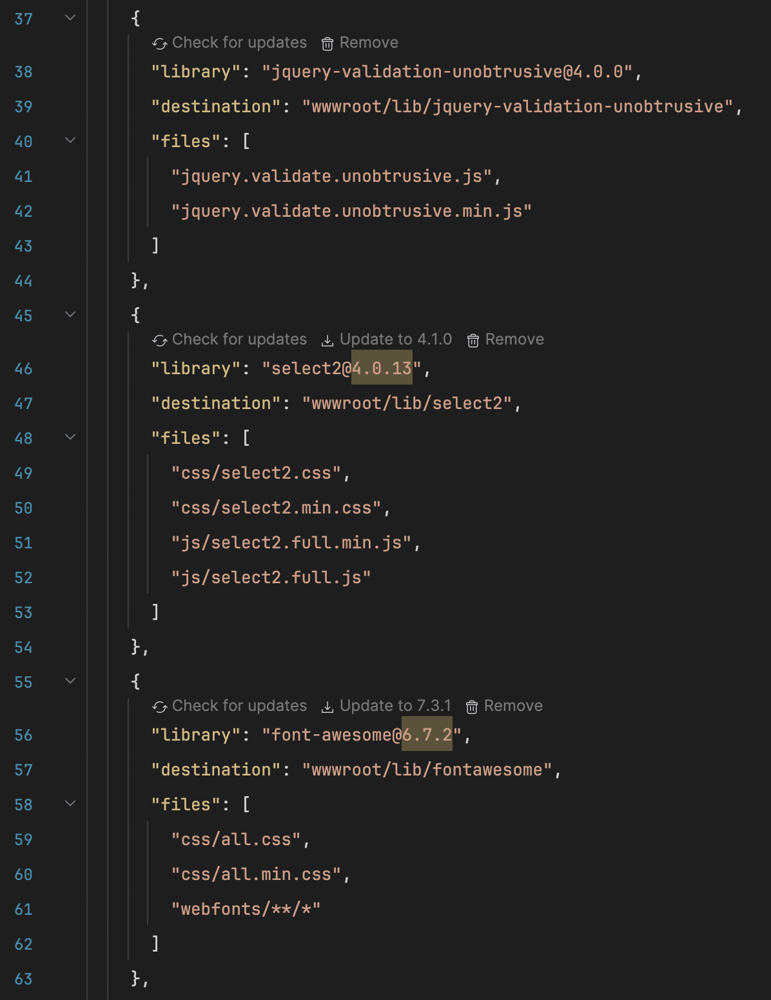

# LibMan for Rider

[](https://plugins.jetbrains.com/plugin/34253-libman-gui)
[](https://plugins.jetbrains.com/plugin/34253-libman-gui)
[](https://github.com/iamr8/libman-rider/actions/workflows/build.yml)

Bring Visual Studio's **Library Manager (LibMan)** experience to JetBrains Rider. Manage
client-side libraries in `libman.json` without leaving the editor: check for updates, update to a
newer version, remove, restore, and clean - backed by the official
[`libman`](https://learn.microsoft.com/aspnet/core/client-side/libman/libman-cli) CLI.

Rider has no built-in LibMan support (see the long-standing request
[RIDER-15368](https://youtrack.jetbrains.com/issue/RIDER-15368)). This plugin fills that gap.



## Features

Open a `libman.json` and every library is checked for updates (cancellable; results are cached).
For each library, right in the editor:

- **Amber version highlight** when a newer version exists.
- **An action row above the line** - **Check for updates**, one **Update to X** per available
  version (patch / minor / major / pre-release), and **Remove** (runs `libman uninstall` after a
  confirm). Each link has an icon and a hand cursor.
- **A description tooltip** on the library name, from the provider, with a link to the library's
  page.
- **Manifest checks** - a warning on an unknown provider, and a hint when a newer `libman.json`
  schema version is available.

Providers supported: **cdnjs**, **unpkg** (npm), and **jsDelivr** (npm + GitHub).

Also:

- **Settings** (Settings | Tools | LibMan): include pre-releases, check-on-open, and cache
  lifetime.
- **Context-menu actions** on `libman.json` (Solution Explorer and editor):
  **Restore**, **Clean**, **Manage**.
- The IDE **suggests this plugin** when you open a `libman.json`.
- CLI, network, and provider errors are shown as notifications with a **Copy Details**
  action - not as plugin crashes.

## Install

From the [JetBrains Marketplace](https://plugins.jetbrains.com/plugin/34253-libman-gui): in Rider,
open **Settings | Plugins | Marketplace**, search **LibMan**, and click **Install**. The IDE also
suggests the plugin the first time you open a `libman.json`.

## Requirements

- JetBrains Rider 2024.3 or newer.
- .NET SDK on `PATH`.
- The LibMan CLI:

  ```bash
  dotnet tool install -g Microsoft.Web.LibraryManager.Cli
  ```

## How it works

Available versions and the description come from the provider's public API - cdnjs
(`api.cdnjs.com`), npm (`registry.npmjs.org`, for unpkg and npm-form jsDelivr), and the jsDelivr
data API (for GitHub-form jsDelivr). Lookups are cached per project (the lifetime is configurable in
settings); the **Check for updates** link forces a refresh. Update, remove, restore, and clean shell
out to the `libman` CLI, run in the manifest's own directory - so multiple `libman.json` files in
one solution are handled independently.

## Building

Tests and the plugin build run in CI (see `.github/workflows/build.yml`). Locally, if you have a
JDK and the Gradle wrapper:

```bash
./gradlew test          # pure logic: id parsing, semver, update buckets, catalog parsers
./gradlew buildPlugin   # produces build/distributions/*.zip
./gradlew runIde        # sandbox Rider with the plugin
```

## License

[MIT](LICENSE). Wraps the MIT-licensed [LibMan CLI](https://github.com/aspnet/LibraryManager),
which the user installs separately; this plugin bundles none of its code.

<sub>Not affiliated with or endorsed by Microsoft. LibMan and Library Manager are names of the Microsoft tool this plugin integrates.</sub>
